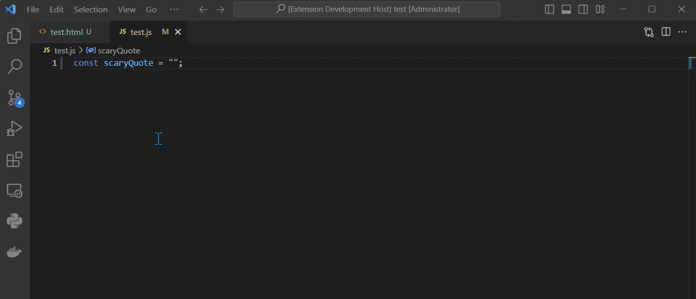
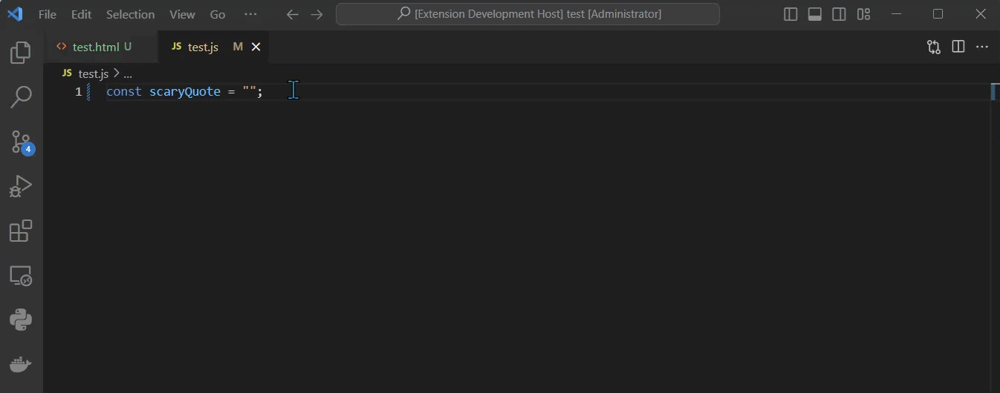

# Lorem King README

LoremKing is a Visual Studio Code extension that replaces the traditional "Lorem ipsum" placeholder text with something more engaging—famous quotes from Stephen King novels. Whether you're a developer working on HTML, JavaScript, or any other type of file, this extension adds a bit of intrigue to your mock text with a simple trigger.

Created by: Pete Januarius [(Nexgen STEM School)](https://www.nexgenstemschool.com.au)

## Features

### The VS Code Command

You can insert text with the command (`Ctrl+Shift+P`): **LoremKing: Insert Stephen King Quote**.

Alternatively, you can insert text inline simply by typing into the editor the keyword: `deadzone` which pays homage to one of my favourite King books: "The Dead Zone"

## Requirements

N/A

## Extension Settings

N/A

## Known Issues

None

## Release Notes

### 1.0.0

Initial release of Lorem King

## Working with Markdown

You can author your README using Visual Studio Code.  Here are some useful editor keyboard shortcuts:

* Split the editor (`Cmd+\` on macOS or `Ctrl+\` on Windows and Linux)
* Toggle preview (`Shift+Cmd+V` on macOS or `Shift+Ctrl+V` on Windows and Linux)
* Press `Ctrl+Space` (Windows, Linux, macOS) to see a list of Markdown snippets

## For more information

* [Visual Studio Code's Markdown Support](http://code.visualstudio.com/docs/languages/markdown)
* [Markdown Syntax Reference](https://help.github.com/articles/markdown-basics/)

**Enjoy!**
