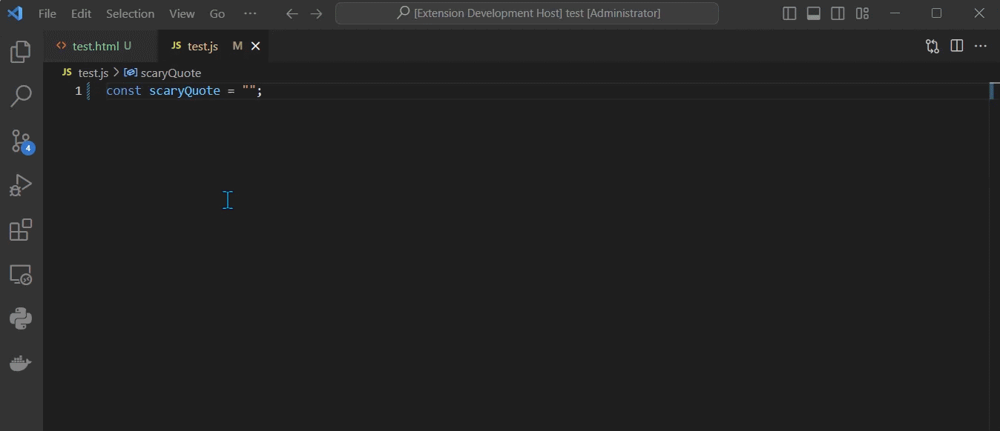
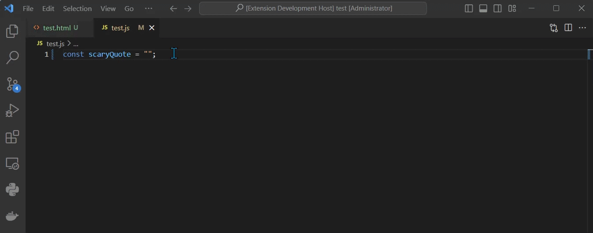

# Lorem King

Horror-themed placeholder text generator for Visual Studio Code, inspired by Stephen King. Three content modes, flexible text generation by words, sentences, or paragraphs, and the classic `deadzone` inline trigger.

Created by: Pete Januarius [(Nexgen STEM School)](https://www.nexgenstemschool.com.au)

## What's New in v2.0

- **Three content modes**: Quote Mode, King-Style Ipsum, and Creepy Placeholder
- **Flexible generation**: generate text by words, sentences, or paragraphs
- **Replace selection**: replace selected text with generated content
- **Extension settings**: configure default mode, paragraph count, and attribution
- **Structured content library**: all content stored in organized JSON files

## Features

### Commands

Open the Command Palette (`Ctrl+Shift+P` / `Cmd+Shift+P`) and search for:

| Command | Description |
|---------|-------------|
| **Lorem King: Insert Quote** | Inserts a random Stephen King quote at the cursor |
| **Lorem King: Generate Custom Text** | Choose a mode, unit (words/sentences/paragraphs), and amount, then insert at cursor |
| **Lorem King: Replace Selection with Lorem King Text** | Replace selected text with generated content |

### Content Modes

- **Quote Mode** — Real Stephen King quotes with optional source attribution
- **King-Style Ipsum** — Horror-flavored literary lorem ipsum with a dark, atmospheric tone
- **Creepy Placeholder** — Short, playful, eerie placeholder text ideal for UI mockups

### Inline Trigger: `deadzone`

Type `deadzone` in any file to trigger an autocomplete suggestion that replaces the keyword with a random Stephen King quote. This feature is preserved from v1.

## Extension Settings

Configure Lorem King in your VS Code settings:

| Setting | Type | Default | Description |
|---------|------|---------|-------------|
| `loremKing.defaultMode` | string | `"quote"` | Default content mode (`quote`, `king-ipsum`, or `creepy-placeholder`) |
| `loremKing.defaultParagraphCount` | integer | `3` | Default number of paragraphs when generating by paragraphs |
| `loremKing.includeAttribution` | boolean | `true` | Include source attribution when inserting quotes |

## Requirements

None. Lorem King works out of the box with no external dependencies.

## Known Issues

None.

## Release Notes

### 2.0.0

- Added three content modes: Quote, King-Style Ipsum, Creepy Placeholder
- Added text generation by words, sentences, and paragraphs
- Added replace-selection command
- Added extension settings for default mode, paragraph count, and attribution
- Migrated content to structured JSON library
- Preserved `deadzone` inline trigger from v1

### 1.0.0

Initial release of Lorem King.

**Enjoy!**
